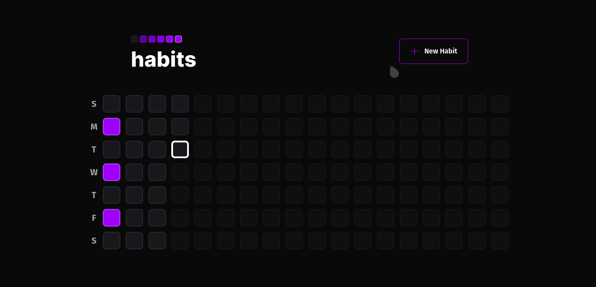

<h1 align="center">
   
</h1>
<h1 align="center" widht="50%">
  
  
  
</h1>

## ⚡️ The Project
  Habits tracker full-Stack app developed during the NLW Event by RocketSeat using React, React-Native and NodeJS.
  
  
## 🎯 Features
 - Habits creation and tracking
 - Animations
 - API Connections
  
## 🖥️ Used Tecnologies
 - [ReactJS](https://reactjs.org/)
 - [React-Native](https://reactnative.dev/)
 - [NodeJS](https://nodejs.org/en/)
 - [Fastify](https://www.fastify.io/)
 - [Expo](https://expo.dev/)

## ⚙️ Dependencies
 - [NodeJS](https://nodejs.org/en/)
 
## 🚀️ Getting Started

1. Clone this repository: 

```bash
git clone https://github.com/avnerjose/reactjs-react-native-nodejs-habits.git && cd reactjs-react-native-nodejs-habits
```
2. Install all dependencies

- Backend
```bash
cd server && npm i
```
- Frontend
```bash
cd web && npm i
```
- Mobile
```bash
cd mobile && npm i
```

3. Start the application

- Backend

```bash
cd server #Selecting backend folder
```
```bash
npx prisma migrate dev #Migrating database
```
```bash
npx prisma db seed #Seeding database
```
```bash
npm run dev #Run backend
```
Obs: Make requests to [localhost:3333](http://localhost:3333) to test it

- Frontend
  
```bash 
cd web #Selecting frontend folder
```
```bash
npm run dev #Run frontend
```
Obs: Make requests to [localhost:5173](http://localhost:5173) to test it


- Mobile 


```bash
npx expo start 
```
Obs: Run an Mobile Emulator with AndroidStudio or install the Expo app on your phone to test it.